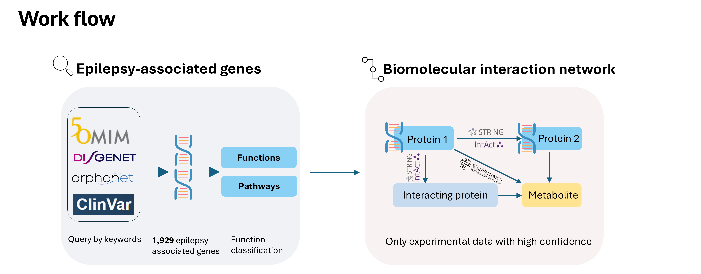

# # Genetic Epilepsy Interaction Networks
This repo is to retrieve human gene-associated interactions from **STRING, IntAct, and WikiPathways** for genetic epilepsy network analysis. The Python scripts take Ensembl gene IDs for the genes that are associated with epilepsy as input and export filtered, undirected interactions for downstream analysis.

The script can be adapted to different input genes and confidence filtering based on the application.




## Repository contents

| File | Purpose |
| --- | --- |
| [STRING.py](STRING.py) | Retrieve human STRING associations, apply confidence and evidence filters, and export unique protein pairs. |
| [IntAct.py](IntAct.py) | Retrieve human IntAct interactions, apply MI-score and detection-method filters, and export unique protein pairs. |
| [WP.py](WP.py) | Extract selected annotated interactions from human WikiPathways GPML files. |
| [metabolites to delete.xlsx](metabolites%20to%20delete.xlsx) | List of chemicals designated for exclusion from the interaction network to avoid overrepresentation. |
| [datavisual.ipynb](datavisual.ipynb) | Jupyter notebook for data analysis and visualization. |

## Requirements

The Python scripts require Python 3 and the following packages:
```bash
python -m pip install pandas requests openpyxl
```

## Input data
The input workbook is in a `data` folder. Each script reads one Ensembl gene ID per row from the `Ensembl_ID` column and drops duplicate IDs.

| Workbook in `data/` | Sheet | Input Column |
| --- | --- | --- |
| `Supplementary File 1.xlsx` | `Table S5` | `Ensembl_ID` |


## Interaction filters

### STRING

`STRING.py` uses human STRING version 12.0 data. Ensembl gene IDs are mapped to STRING protein IDs through the aliases file. An interaction is retained when at least one endpoint maps to an input gene.

Default filters:

- Chosen combined score: **990–1000**.
- Experimental evidence: `experimental > 0` **or** `experimental_transferred > 0`.

### IntAct

`IntAct.py` maps input Ensembl gene IDs to UniProt accessions and reads the human IntAct MITAB archive (version 20260114). It retains human–human records with usable UniProt identifiers, applies protein-type and detection-method filters, and requires at least one endpoint to match the input set.

The chosen MI-score range is **0.60–1.00**. 

### WikiPathways

`WP.py` downloads a human GPML archive (version 20260810) from the current WikiPathways release directory. It retains `GeneProduct` and `Protein` data nodes with explicit Ensembl cross-references and requires at least one interaction endpoint to match an input gene.

The accepted interaction annotations are:

- `mim-binding`
- `mim-complex`
- `mim-catalysis`
- `mim-stimulation`
- `mim-inhibition`
- `mim-necessary-stimulation`
- `mim-modification`

No numerical confidence threshold is applied. These annotations describe pathway relationships and do not all imply direct physical binding.


## Outputs

| Source | File | Contents |
| --- | --- | --- |
| 🔵 STRING | `string_ppi_edges.csv` | Protein pairs, endpoint identifiers and labels, combined scores, and evidence-channel scores. |
| 🔵 STRING | `string_edge_counts_by_score.csv` | Edge counts at each tested combined-score threshold. |
| 🔵 STRING | `unmapped_ensembl_ids_string.csv` | Input genes without STRING mappings, when reported. |
| 🟢 IntAct | `intact_ppi_edges.csv` | Protein pairs, endpoint identifiers and labels, MI scores, evidence counts, and publication metadata. |
| 🟢 IntAct | `intact_edge_counts_by_score.csv` | Edge counts at each tested MI-score threshold. |
| 🟢 IntAct | `unmapped_ensembl_ids.csv` | Input genes without UniProt mappings, when reported. |
| 🟠 WikiPathways | `wikipathways_ppi_edges.csv` | Gene pairs, interaction annotations, pathway identifiers and names, and evidence counts. |
| 🟠 WikiPathways | `genes_not_in_wikipathways.csv` | Input genes not encountered among parsed interaction endpoints, when reported. |

## Downstream analysis

The [datavisual.ipynb](datavisual.ipynb) notebook analyzes input genes and interactions through the following steps:

1. Check gene sources and cross-reference the input gene list.
2. Perform GO enrichment and pathway overrepresentation analyses.
3. Examine the distribution of interaction sources.
4. Visualize HotNet2 results.
